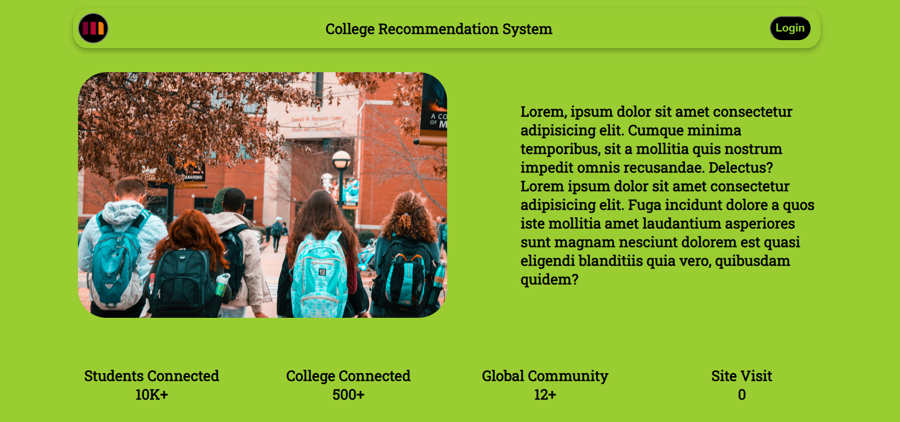

# Project Title

College Recommendation System

## Description

This is a college recommendation system, which will provide possible college names for admission of students upon entering their marks. 

## Installation

1.  Download the zip file of the repository.
2.  Extract the zipped file and open it in the code editor.
3.   In the terminal go to project directory by <br>
 ```cd minor-project```
4.  ```npm install```
5. ``` npm run dev```
<br>
Now site is live on your local host http://localhost:5173




## Credits

- Krishna Biswal
- Sohan Kumar Sahu
- Shruti Patel
- Danish Khan


